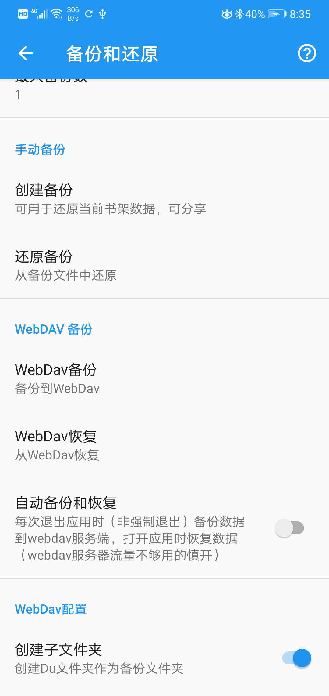
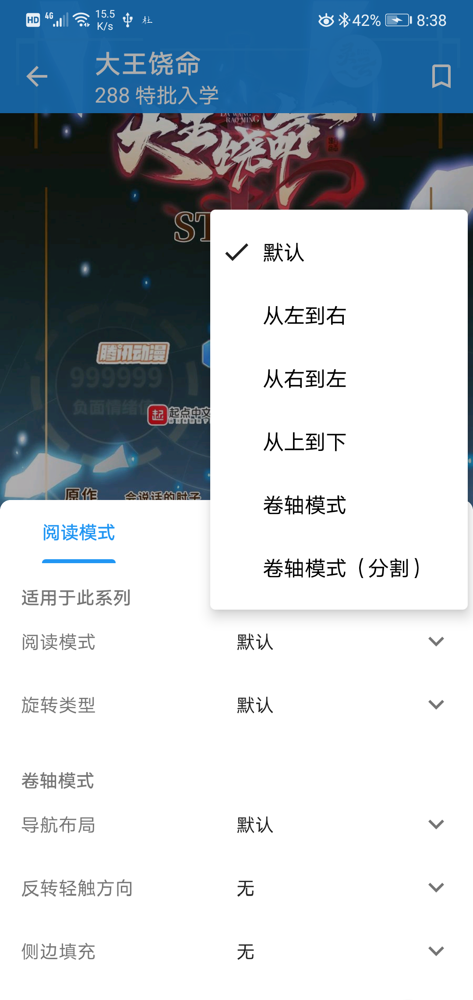
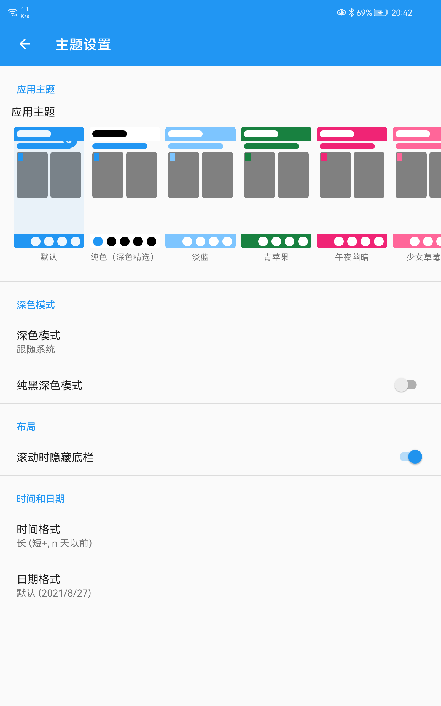

# Du漫画浏览器

> 通过安装插件的模式，观看漫画

# 功能简介
- 左到右阅读模式
- 右到左阅读模式
- 上到下阅读模式
- 卷轴阅读模式
- 收藏漫画、检查漫画更新
- 本地备份恢复、webdav云备份和恢复功能
- 

# 下载
> 安卓apk下载地址[软件下载](https://github.com/Haleydu/Du/releases)

# 应用截图
- 手机和平板

# 设计思路
> 软件的设计思路来自国外知名的漫画软件“趣立”

# 关注Cimoc微信公众号获取更多插件

